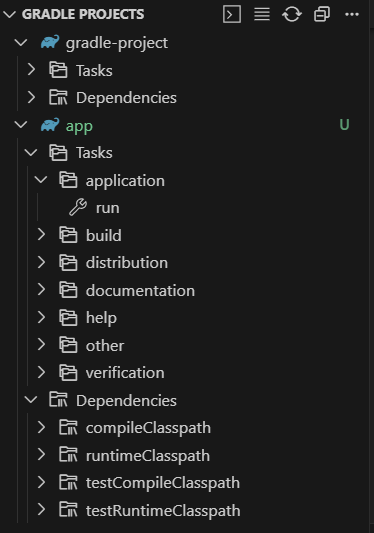
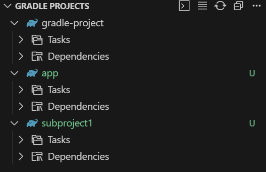
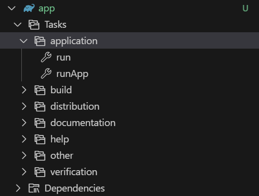

# Gradle Tutorial

## 0. 前提条件

- Linux or WSL on Windows
- Ubuntu 24.04 LTS
- bash shell

## 1. 環境構築 (Linux, WSL on Windows)
### sdkmanのインストール
sdkmanというSoftware Development Kit Managerを用いる。その前に、インストールする
ために必要なcurl,zip,unzipをインストールする。
```bash
sudo apt update
sudo apt install curl zip unzip
```
[公式ドキュメント](https://sdkman.io/install/)を参照し、以下のコマンドを実行し、sdkmanをインストールする。
```bash
curl -s "https://get.sdkman.io" | bash
```
インストールが完了したら、シェルを開きなおし、以下のコマンドを実行してsdkコマンドが使える確認する。
```bash
sdk version

# SDKMAN!
# script: 5.19.0
# native: 0.7.4 (linux x86_64)

```
### Javaのインストール
以下のコマンドを実行することで、インストール可能なJavaのバージョンを確認する。
```bash
sdk list java
# ================================================================================
# Available Java Versions for Linux 64bit
# ================================================================================
#  Vendor        | Use | Version      | Dist    | Status     | Identifier
# --------------------------------------------------------------------------------
#  Corretto      |     | 24.0.1       | amzn    |            | 24.0.1-amzn         
#                |     | 24           | amzn    |            | 24-amzn             
#                |     | 23.0.2       | amzn    |            | 23.0.2-amzn         
#                |     | 21.0.7       | amzn    |            | 21.0.7-amzn         
#                |     | 21.0.6       | amzn    |            | 21.0.6-amzn         
#                |     | 17.0.15      | amzn    |            | 17.0.15-amzn        
#                |     | 17.0.14      | amzn    |            | 17.0.14-amzn        
#                |     | 11.0.27      | amzn    |            | 11.0.27-amzn        
#                |     | 11.0.26      | amzn    |            | 11.0.26-amzn        
#                |     | 8.0.452      | amzn    |            | 8.0.452-amzn        
#                |     | 8.0.442      | amzn    |            | 8.0.442-amzn        
#  Dragonwell    |     | 21.0.7       | albba   |            | 21.0.7-albba        
#                |     | 21.0.6       | albba   |            | 21.0.6-albba        
#                |     | 17.0.15      | albba   |            | 17.0.15-albba    
# ......   
```
今回は、`17.0.15-amzn`をインストールする。
```bash
sdk install java 17.0.15-amzn

# Downloading: java 17.0.15-amzn

# In progress...

# ######################################################################################################################################################################################################################################## 100.0%

# Repackaging Java 17.0.15-amzn...

# Done repackaging...

# Installing: java 17.0.15-amzn
# Done installing!


# Setting java 17.0.15-amzn as default.
```
Javaがインストールされたことを以下のコマンドで確認する。
```bash
# バージョン確認
java --version
# openjdk 17.0.15 2025-04-15 LTS
# OpenJDK Runtime Environment Corretto-17.0.15.6.1 (build 17.0.15+6-LTS)
# OpenJDK 64-Bit Server VM Corretto-17.0.15.6.1 (build 17.0.15+6-LTS, mixed mode, sharing)

# インストール先のパスの確認 (環境によって出力は異なる)
which java
# /root/.sdkman/candidates/java/current/bin/java

# 環境変数の確認
echo $JAVA_HOME
# /root/.sdkman/candidates/java/current
```

### Gradleのインストール
以下のコマンドを実行することで、インストール可能なGradleのバージョンを確認する。
```bash
sdk list gradle
```
今回は最新の`8.14.2`をインストールする。
```bash
sdk install gradle 8.14.2
```
Gradleがインストールされたことを以下のコマンドで確認する。
```bash
# バージョン確認
gradle --version

# Welcome to Gradle 8.14.2!

# Here are the highlights of this release:
#  - Java 24 support
#  - GraalVM Native Image toolchain selection
#  - Enhancements to test reporting
#  - Build Authoring improvements

# For more details see https://docs.gradle.org/8.14.2/release-notes.html


# ------------------------------------------------------------
# Gradle 8.14.2
# ------------------------------------------------------------

# Build time:    2025-06-05 13:32:01 UTC
# Revision:      30db2a3bdfffa9f8b40e798095675f9dab990a9a

# Kotlin:        2.0.21
# Groovy:        3.0.24
# Ant:           Apache Ant(TM) version 1.10.15 compiled on August 25 2024
# Launcher JVM:  17.0.15 (Amazon.com Inc. 17.0.15+6-LTS)
# Daemon JVM:    /root/.sdkman/candidates/java/17.0.15-amzn (no JDK specified, using current Java home)
# OS:            Linux 6.11.0-26-generic amd64

```
## 2. プロジェクトの作成
参考: [Gradleチュートリアル](https://docs.gradle.org/current/userguide/part1_gradle_init.html)

プロジェクト用のディレクトリを作成し、その中で`gradle init`コマンドを実行する。
```bash
mkdir gradle-project # 任意のプロジェクト名
cd gradle-project
gradle init  # プロジェクトの初期化
# 以下、対話式ダイアログが表示されるので、以下にように答える。

# Select type of build to generate:
#   1: Application
#   2: Library
#   3: Gradle plugin
#   4: Basic (build structure only)
# Enter selection (default: Application) [1..4] 1 (今回はアプリケーションを開発する)

# Select implementation language:
#   1: Java
#   2: Kotlin
#   3: Groovy
#   4: Scala
#   5: C++
#   6: Swift
# Enter selection (default: Java) [1..6] 1

# Enter target Java version (min: 7, default: 21): 17 (サブプロジェクト毎に変更できるがとりあえず17)

# Project name (default: gradle-project): 

# Select application structure:
#   1: Single application project
#   2: Application and library project
# Enter selection (default: Single application project) [1..2] 1 (選択肢2だと複雑なテンプレートが生成されるので1を選択)

# Select build script DSL:
#   1: Kotlin
#   2: Groovy
# Enter selection (default: Kotlin) [1..2] 2 (Vscodeで開発する際はGroovyを選択、IntelliJ IDEAで開発する際はKotlinを選択)

# Select test framework:
#   1: JUnit 4
#   2: TestNG
#   3: Spock
#   4: JUnit Jupiter
# Enter selection (default: JUnit Jupiter) [1..4] 4 (デフォルトで可。後で簡単に変えられる)

# Generate build using new APIs and behavior (some features may change in the next minor release)? (default: no) [yes, no] no


# > Task :init
# Learn more about Gradle by exploring our Samples at https://docs.gradle.org/8.14.2/samples/sample_building_java_applications.html

# BUILD SUCCESSFUL in 55s
# 1 actionable task: 1 executed

```
そうすると、以下のようなディレクトリ構成が生成される([ドキュメント参照](https://docs.gradle.org/current/userguide/gradle_basics.html))
```
.
|-- app          # `app`サブプロジェクトのディレクトリ
|   |-- build    # ビルド結果が出力されるディレクトリ、gitで追跡しない
|   |   `-- ...
|   |
|   |-- build.gradle # `app`サブプロジェクトのビルド設定ファイル。pom.xmlのようなもの。
|   `-- src      # ソースコードディレクトリ。Mavenと同じディレクトリ構造となっている。
|       |-- main
|       |   |-- java
|       |   |   `-- org
|       |   |       `-- example
|       |   |           `-- App.java
|       |   `-- resources
|       `-- test
|           |-- java
|           |   `-- org
|           |       `-- example
|           |           `-- AppTest.java
|           `-- resources
|-- build  # ルートプロジェクトのビルド出力ディレクトリ。全サブプロジェクトをまとめたJARファイル等が出力される。
|   `-- ...
|
|-- gradle  # Gradle Wrapperディレクトリ。プロジェクト毎に使うGradleのバージョンを固定・管理する。Gitで追跡する。
|   |-- libs.versions.toml # プロジェクト全体で摘要するライブラリのバージョンを記述する。あまり使わない。
|   `-- wrapper # Gradle WrapperのJARファイルが格納される。Gitで追跡するのが慣例
|-- gradle.properties  # 自動生成されたファイル。基本編集しない
|-- gradlew   # Gradle Wrapperの実行用スクリプト。このプロジェクト内でGradleコマンドを使う場合は"./gradlew"を使う。
|-- gradlew.bat # Windows用のスクリプト。
`-- settings.gradle # プロジェクト全体の設定ファイル。サブプロジェクトの名前を登録する。
```
基本的に編集操作をするのは、`settings.gradle`と`build.gradle`の2つのファイルである。
また、**以降システムにインストールされているgradleコマンドは用いず、wrapperを用いてGradleコマンドを実行する。**
例えば、buildタスクを実行したい場合は、以下のコマンドを実行する。
```bash
./gradlew build
```
**wrapper**を用いることで、他の環境でも同一のGradleのバージョンを用いてビルドを行うことができる。
Gradleをインストールししていない環境でもおそらく動く。

## 3. `build.gradle`の設定
* `Plugins`: 依存関係の管理やコンパイル等の機能をPluginから取得する。ここではJavaプログラムの開発に必須な[`java`プラグイン](https://docs.gradle.org/current/userguide/java_plugin.html#java_plugin)と、アプリケーション開発に必須な[`application`プラグイン](https://docs.gradle.org/current/userguide/application_plugin.html)を適用している。どちらもGradleチームが提供しているプラグインである。
* `dependencies`: 依存ライブラリを定義している。定義の仕方は、[mavenリポジトリ](https://mvnrepository.com/artifact/org.apache.flink/flink-streaming-java/1.20.1)に載っているので、それを参考にする。
* `java`: Javaのバージョンを指定する。サブプロジェクト毎に異なるバージョンを指定することも可能。
* `application`: アプリケーションを実行する際の、エントリポイントを指定している。
その他、引数を伴った実行タスクの設定なども行えるので、適宜ドキュメントや生成AIと相談すること。
```Groovy
/*
 * This file was generated by the Gradle 'init' task.
 *
 * This generated file contains a sample Java application project to get you started.
 * For more details on building Java & JVM projects, please refer to https://docs.gradle.org/8.14.2/userguide/building_java_projects.html in the Gradle documentation.
 */

plugins {
    // Apply the Java plugin to add support for Java.
    id 'java'
    // Apply the application plugin to add support for building a CLI application in Java.
    id 'application'
}

repositories {
    // Use Maven Central for resolving dependencies.
    mavenCentral()
}

dependencies {
    // flink dependencies
    implementation "org.apache.flink:flink-streaming-java:1.20.1"
    implementation "org.apache.flink:flink-clients:1.20.1"
    implementation "org.slf4j:slf4j-simple:2.0.9"

    // Use JUnit Jupiter for testing.
    testImplementation libs.junit.jupiter

    testRuntimeOnly 'org.junit.platform:junit-platform-launcher'
}

// Apply a specific Java toolchain to ease working on different environments.
java {
    toolchain {
        languageVersion = JavaLanguageVersion.of(17)
    }
}

application {
    // Define the main class for the application.
    mainClass = 'org.example.App'
}

tasks.named('test') {
    // Use JUnit Platform for unit tests.
    useJUnitPlatform()
}

```

## 4. VSCodeでの開発
VSCodeでの開発を行う場合は、以下の拡張機能をインストールする。
* [Gradle for Java](https://marketplace.visualstudio.com/items?itemName=vscjava.vscode-gradle)
* [Java Extension Pack](https://marketplace.visualstudio.com/items?itemName=vscjava.vscode-java-pack)

拡張機能のインストールが完了した後、プロジェクトディレクトリを開くと、左のパネルにGradleのパネルが表示され、それをクリックすると、
以下のように、`build.gradle`を読み込んで得られたタスク一覧が表示される。


上の例では`gradle-tutorial`というルートプロジェクトの下に`app`というサブプロジェクトがある。`app`サブプロジェクトの`Tasks:application:run`タスクを
実行すると、`app`サブプロジェクト内のソースコードがコンパイルされ、指定されたクラスのmain関数が実行される。

## 5. マルチプロジェクトの設定方法
`subproject1`というサブプロジェクトを作成したい場合は、以下のようなディレクトリ構成をルートプロジェクトの下に追加する。
```
.
|-- subproject1
|   |-- build.gradle
|   `-- src
|       `-- main
|           `-- java
|               `-- org
|                   `-- example
|                       `-- App.java
```
`subproject1/build.gradle`は以下のように設定される。
```Groovy
plugins {
  id 'java'
  id 'application'
}

repositories {
  mavenCentral()
}

application {
  mainClass = 'com.example.App'
}

dependencies {
  // NOTE: Add your dependencies here
}
```
これを行った後、ルートプロジェクトの`./settings.gradle`にサブプロジェクトの名前を登録する。
```Groovy
include 'subproject1'
```
すると、VSCodeのGradleパネルにサブプロジェクトが表示されるようになる。


## 6. カスタムタスクの定義方法
カスタムタスクを定義することもできる。
例えば、`app/build.gradle`に以下のようなタスクを定義することで、`app`サブプロジェクトを引数付きで実行することができる。
```Groovy
task runApp(type: JavaExec) {
    group = 'application'
    description = 'Appを引数付きで実行'
    
    // 依存タスクを指定する。
    dependsOn ':app:build'
    
    // 実行するクラスを指定する。
    classpath = project(':app').sourceSets.main.runtimeClasspath
    mainClass = 'org.example.App'
    
    // プロパティが指定されている場合は、それを使用
    if (project.hasProperty('appArgs')) {
        args project.property('appArgs').split()
    } else {
        // デフォルトの引数を設定
        args 'arg1', 'arg2', 'arg3'
    }
}
```
これを定義した後、Gradleパネルの`app`サブプロジェクトの`Tasks:application:run`タスクの下に`runApp`タスクが表示される。


`runApp`タスクを実行すると、デフォルト引数(`arg1`, `arg2`, `arg3`)で
'org.example.App'クラスのmain関数が実行される。

もし別の引数で実行したい場合は、CLI上にで以下のようにコマンドを実行する。
```bash
./gradlew :app:runApp -PappArgs="arg1 arg2"
```
